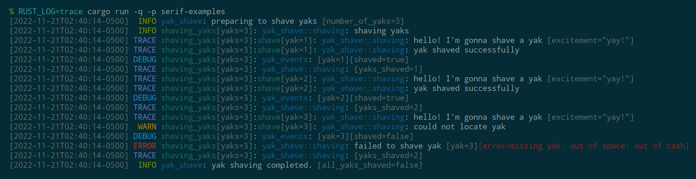

# Serif
An opinionated Rust tracing-subscriber configuration with a focus on readability.

[](https://crates.io/crates/serif)
[](https://docs.rs/serif)



## About

Serif is my take on the best way to configure [`tracing-subscriber`] for use in command-line
applications, with an emphasis on readability of the main log messages. The tracing span scope,
event target, and additional metadata is all rendered with dimmed colors, making the main message
stand out quickly. Or at least it does on the Solarized Dark colorscheme that I prefer.

Serif uses [`EnvFilter`] for filtering using the `RUST_LOG` environment variable, with a default
level of `INFO` if not otherwise configured.

Serif sets up [`FmtSubscriber`] and [`EnvFilter`] in a unified configuration. Basically this is all
to make my life easier migrating from [`env_logger`].

## Usage

All you need is a single dependency in `Cargo.toml` and a single builder chain to set up the global
default tracing subscriber.  For convenience, `serif` re-exports `tracing` and provides the common
log macros in `serif::macros`.

```rust
use serif::macros::*;
use serif::tracing::Level;

fn main() {
    serif::Config::new()            // create config builder
        .with_default(Level::DEBUG) // the default otherwise is INFO
        .init();                    // finalize and register with tracing
    info!("Hello World!");
    do_stuff();
    debug!("Finished doing stuff");
}
```

For more advanced use-cases, Serif provides `EventFormatter` which implements [`FormatEvent`], and
`FieldFormatter` which implements [`FormatFields`]. These objects can be passed to
a [`SubscriberBuilder`] along with whatever other options are desired.

## ANSI Terminal Colors

By default, Serif enables ANSI coloring when the output file descriptor (stdout or stderr) is a TTY
and the environment variable `NO_COLOR` is either unset or empty. At the moment, the specific color
styles are not customizable.

A note to advanced users configuring a [`SubscriberBuilder`] manually: `EventFormatter` and
`FieldFormatter` do not track whether ANSI colors are enabled directly, instead they obtain this
from the [`Writer`] that's passed to various methods. Call [`SubscriberBuilder::with_ansi`] to
configure coloring in custom usage.

## License

Serif is released under the Apache 2.0 license.

Additionally, heavy inspiration has been taken from the implementation of
[`tracing-subscriber`](https://github.com/tokio-rs/tracing/tree/master/tracing-subscriber), which is
released under the MIT license.

[`tracing-subscriber`]: https://lib.rs/crates/tracing-subscriber
[`FmtSubscriber`]: https://docs.rs/tracing-subscriber/latest/tracing_subscriber/fmt/struct.Subscriber.html
[`EnvFilter`]: https://docs.rs/tracing-subscriber/latest/tracing_subscriber/struct.EnvFilter.html
[`env_logger`]: https://lib.rs/crates/env_logger
[`FormatEvent`]: https://docs.rs/tracing-subscriber/latest/tracing_subscriber/fmt/trait.FormatEvent.html
[`FormatFields`]: https://docs.rs/tracing-subscriber/latest/tracing_subscriber/fmt/trait.FormatFields.html
[`SubscriberBuilder`]: https://docs.rs/tracing-subscriber/latest/tracing_subscriber/fmt/struct.SubscriberBuilder.html
[`Writer`]: https://docs.rs/tracing-subscriber/latest/tracing_subscriber/fmt/format/struct.Writer.html
[`SubscriberBuilder::with_ansi`]: https://docs.rs/tracing-subscriber/latest/tracing_subscriber/fmt/struct.SubscriberBuilder.html#method.with_ansi
